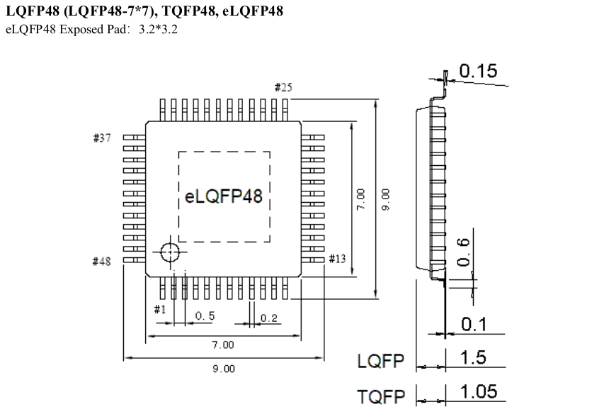

# My CH32V203 Development Boards

Here I will start to develop my CH32V203 development boards and collect all related materials.

## Code

[Example code](./Example_code/README.md)

## WCH Docs

- [CH32V203 Datasheet](doc/CH32V203DS0.PDF)
- [CH32F/V20x_V30x_V31x Reference Manual](doc/CH32FV2x_V3xRM.PDF)
- [CH32V20x Evaluation Board Reference](doc/CH32V20x_Evaluation_Board_Reference-EN.pdf)
- [CH32V20x Schematics](doc/CH32V20xSCH.pdf)
- [QingKeV4 Microprocessor Manual](doc/QingKeV4_Processor_Manual.PDF)
- [WCH Touch Application Guide](doc/WCH_TouchApplicationGuide.PDF)
- [Common Package Dimensions for CH Series ICs](doc/PACKAGE.PDF)

## CH32V203F6P6

## CH32V203C8T6

_______________
Tauno Erik ♥ Väimela ♥ 2025
